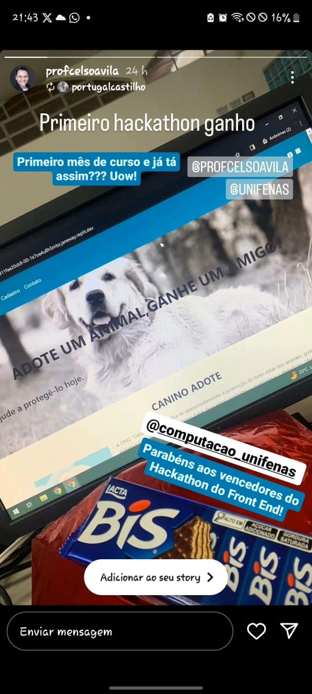

<h1>Site ganhador do primeiro Hackathon de Front End</h1>

 
  
 
    
    <h1 align="center">Objetivo</h1>
    
Desenvolver um pequeno site utilizando apenas HTML e CSS, com o tema
Adoção de Animais, que contenha informações sobre animais disponíveis para adoção,
os procedimentos de adoção, e como as pessoas podem contribuir para a causa.

   

    
  
  <h1 align="center">Requisitos</h1>
    <ul>
    <li>O site deve conter pelo menos três páginas: uma página inicial, uma página de
informações sobre os animais disponíveis para adoção, e uma página com
informações sobre como adotar.</li>
    <li>Utilizar HTML para estruturar o conteúdo do site, incluindo cabeçalho, rodapé,
menu de navegação, e conteúdo das páginas.</li>
    <li>Utilizar CSS para estilizar o site, incluindo cores, fontes, espaçamentos, e layout.</li>
    <li>Incluir pelo menos uma tabela para listar informações sobre os animais
disponíveis para adoção (como nome, idade, espécie etc.).</li>
    <li>Incluir pelo menos uma imagem em cada página, representando os animais
disponíveis para adoção ou ilustrando o tema.</li>
    <li>Incluir links para redes sociais ou outras organizações de adoção de animais,
permitindo que os visitantes do site possam encontrar mais informações.</li>
    </ul>

